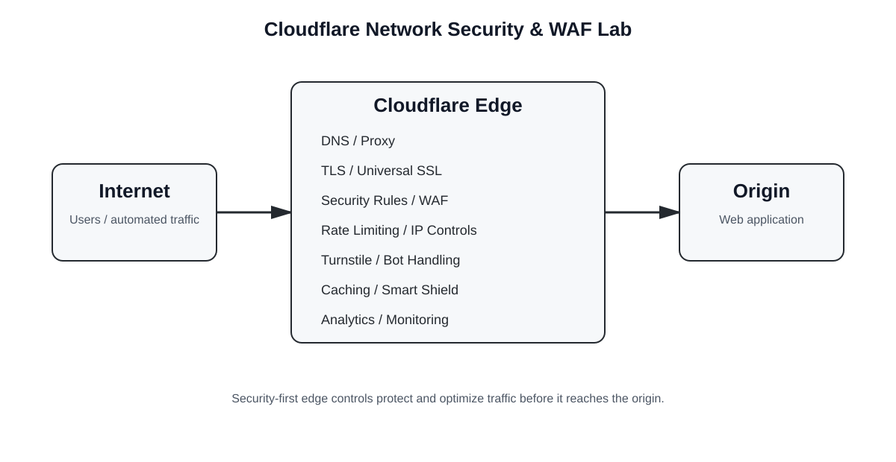

# Cloudflare Network Security & WAF Lab

Hands-on Cloudflare security and performance lab covering DNS, TLS, custom security rules, rate limiting, Turnstile, caching, traffic analytics, and origin monitoring.

**Platform:** Cloudflare Free  
**Domain:** `practicecf.cfd`  
**Status:** Active lab

## Overview

This project documents the configuration of a web application placed behind Cloudflare, with a focus on practical cloud and web-security controls.

### Architecture



```
Internet
   |
   v
Cloudflare Edge
   |
   +-- DNS / Proxy
   +-- TLS / Universal SSL
   +-- Security Rules
   +-- Rate Limiting
   +-- Turnstile
   +-- Caching
   +-- Analytics / Monitoring
   |
   v
Origin Web Server
```

## Implemented Controls

### DNS & TLS
- Configured Cloudflare DNS and proxying for the website.
- Universal SSL is active for the apex domain and wildcard subdomains.
- Current SSL/TLS mode: **Flexible**.
- TLS 1.3 traffic was observed in Cloudflare analytics.
- Certificate Transparency Monitoring alerts are active.

### Custom Security Rules
Five custom rules are configured; four are active.

The main blocking rule targets patterns associated with:
- SQL injection
- Directory traversal
- Sensitive configuration files
- Backup files
- Executable files
- Command-injection-style parameters
- XML-RPC access
- Sensitive filesystem paths
- Empty User-Agent requests

Additional rules cover HTTP/1.0 challenge handling, verified/good-bot handling, and a development-phase IP restriction. One IP-based test rule is disabled.

### Rate Limiting
An active rate-limiting rule named **Login protection** targets `/login.html` and uses a **Block** action.

### Turnstile
A Cloudflare Turnstile widget is configured for `practicecf.cfd` and embedded in the site's contact and login interfaces. A live browser test generated real Turnstile challenge activity that was captured in the Cloudflare dashboard:
- Mode: **Managed**
- Pre-clearance: **No pre-clearance**
- Last 24-hour dashboard snapshot: **26 challenges issued**
- **4 challenges solved**
- **22 challenges unsolved**
- **15.38% likely human**
- **84.62% likely bot**
- All 4 solved challenges were interactive solves
- **Siteverify requests: 0**
- **Valid tokens: 0**
- **Invalid tokens: 0**

The lab therefore demonstrates **Turnstile widget deployment, challenge generation, and analytics**, but **server-side Siteverify validation is not implemented**. Cloudflare explicitly reports that widget tokens are not currently being validated by the application backend. The practice site is a static HTML site, so completing Siteverify would require adding a server-side component rather than placing the secret key in the client-side HTML.

See [Turnstile evidence](docs/turnstile.md) for the detailed implementation and test notes.

### Caching
The domain-level cache rule:
- Makes responses eligible for cache.
- Uses a **1-day Edge TTL**.
- Uses a **4-hour Browser TTL**.
- Overrides the origin cache-control policy for the configured TTL.

A separate rule bypasses cache for `/login.html`.

### Smart Shield
Smart Shield was activated on **1 October 2026**.

The Cloudflare Observatory snapshot captured before activation showed a **40.18% cache hit ratio**. No post-activation performance improvement is claimed yet.

## Security Analytics

Captured Cloudflare dashboard snapshots showed:

**30-day Security Overview**
- 39.76k requests
- 19.14% mitigated
- 19.97% served by Cloudflare
- 60.89% served by origin

**24-hour Security Analytics**
- 2.6k requests
- 706 requests mitigated
- 186 served by Cloudflare
- 1.7k served by origin

These are dashboard snapshots, not a count of confirmed successful attacks.

## Origin Analytics

Captured Origin Analytics showed:
- Connection success rate: **68%**
- P95 response-time headline: **383 ms**
- Error rate: **0%**
- P50/P75: **201 ms**
- P95/P99: **229 ms**
- TCP handshake: **102 ms**
- TLS handshake: **1.4 ms**
- Response wait: **104 ms**

Observed request paths included `/.s3cfg`, `/shop/.env`, `/dashboard/.env`, and `/gcp-key.json`. These are documented as observed request paths only; no successful compromise is claimed.

## Cloudflare Managed Protection

The captured Security Overview showed these detection categories running:
- Web application exploits
- DDoS attacks
- API abuse
- Fraud protection

These are distinguished from the custom controls configured for this lab.

## Evidence

Screenshots will be stored under [`screenshots/`](screenshots/).

See [`screenshots/README.md`](screenshots/README.md) for the exact filenames and what each screenshot should show.

**Before uploading screenshots, redact:** origin IP addresses, email addresses, account identifiers where unnecessary, API tokens, passwords, Turnstile secrets, cookies, and other credentials.

## Accuracy Notes

This repository deliberately distinguishes between controls configured in the lab and Cloudflare-managed protections.

Cloudflare Trace is **not** documented as used because a verified Trace result was not captured.

Historical claims of a 50% cache hit rate and 51% bandwidth reduction are not used because the captured evidence did not substantiate those exact figures.

## Future Improvements
- Capture a real Cloudflare Trace result if accessible.
- Compare Observatory metrics after Smart Shield has been active for a meaningful period.
- Continue testing security rules with reproducible requests.
- Add sanitized dashboard screenshots.

## Related Portfolio

[Cloud Security & DevOps Portfolio](https://github.com/Smithn1205/Cloud-Security-DevOps-Portfolio)
